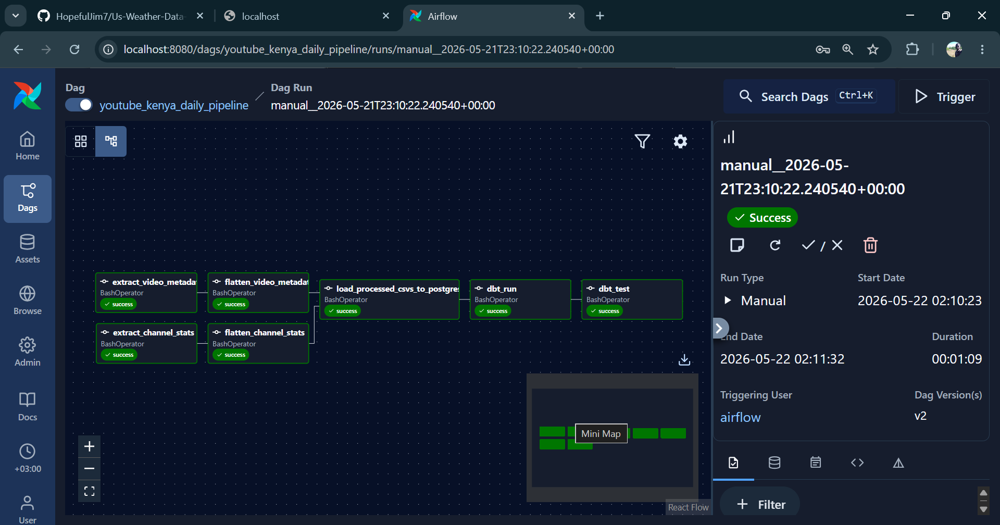
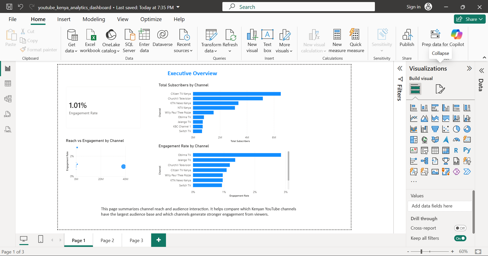
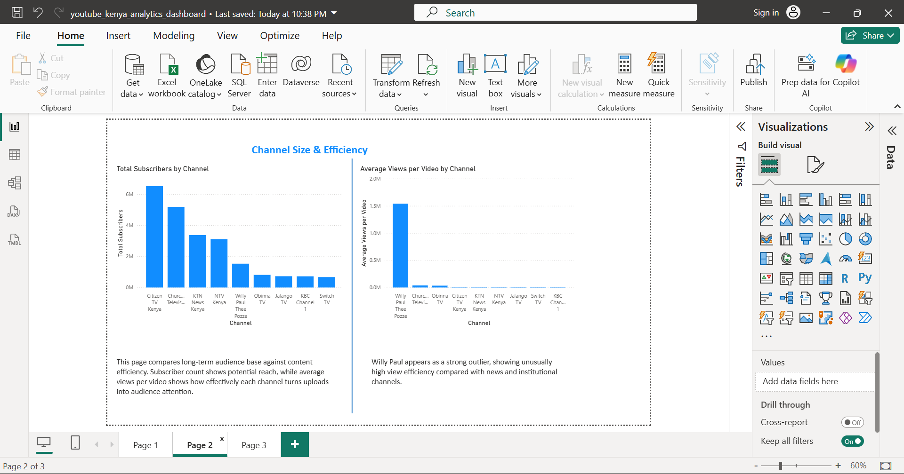
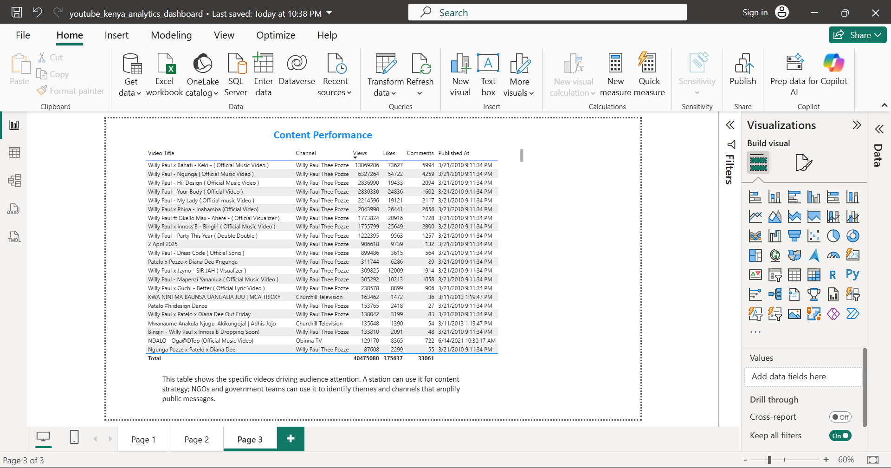

# YouTube Kenya Analytics Pipeline

An end-to-end data engineering project that ingests YouTube channel and video metrics for Kenyan content creators and media houses, stores raw snapshots, transforms analytics-ready models with dbt, orchestrates the workflow with Airflow, and powers BI dashboards.

## First Dive

The first implementation slice focuses on:

1. Defining target Kenyan YouTube channels.
2. Setting up YouTube API access.
3. Testing a single channel lookup.
4. Creating the raw storage path convention.

## Setup

Create a virtual environment:

```bash
python -m venv .venv
```

Activate it on Windows PowerShell:

```bash
.venv\Scripts\Activate.ps1
```

Install dependencies:

```bash
pip install -r requirements.txt
```

Create a `.env` file from `.env.example`:

```env
YOUTUBE_API_KEY=your_real_api_key_here
RAW_BUCKET_NAME=youtube-kenya-analytics
RAW_STORAGE_BACKEND=local
RAW_LOCAL_DIR=data/raw
POSTGRES_HOST=localhost
POSTGRES_PORT=5433
POSTGRES_DB=youtube_analytics
POSTGRES_USER=youtube_user
POSTGRES_PASSWORD=youtube_password
```

Run the first API test:

```bash
cd ingestion
python test_single_channel.py
```

## Run Channel Stats Ingestion

Fetch raw channel statistics for all configured channels:

```bash
cd ingestion
python extract_channel_stats.py
```

This writes raw JSON to:

```text
data/raw/channel_stats/snapshot_date=YYYY-MM-DD/channel_stats.json
```

## Run Limited Video Metadata Ingestion

Fetch recent video metadata for all configured channels:

```bash
cd ingestion
python extract_video_metadata.py
```

The current script fetches up to 25 recent videos per channel to keep API quota usage low during development.

This writes raw JSON to:

```text
data/raw/videos/snapshot_date=YYYY-MM-DD/videos.json
```

## Flatten Channel Stats

Convert raw channel statistics JSON into a processed CSV:

```bash
python processing/flatten_channel_stats.py
```

By default, the script uses today's snapshot if available. If today's raw snapshot does not exist, it uses the latest available snapshot.

To process a specific snapshot date:

```bash
python processing/flatten_channel_stats.py --snapshot-date 2026-05-18
```

This writes processed CSV output to:

```text
data/processed/channel_stats/snapshot_date=YYYY-MM-DD/channel_stats.csv
```

## Flatten Video Metadata

Convert raw video metadata JSON into a processed CSV:

```bash
python processing/flatten_video_metadata.py
```

By default, the script uses today's snapshot if available. If today's raw snapshot does not exist, it uses the latest available snapshot.

To process a specific snapshot date:

```bash
python processing/flatten_video_metadata.py --snapshot-date 2026-05-18
```

This writes processed CSV output to:

```text
data/processed/videos/snapshot_date=YYYY-MM-DD/videos.csv
```

## Start PostgreSQL

Start the project PostgreSQL database with Docker Compose:

```bash
docker compose up -d
```

The database is exposed to your host machine on port `5433` to avoid conflicts with a local PostgreSQL installation.

Connection settings:

```text
host: localhost
port: 5433
database: youtube_analytics
user: youtube_user
password: youtube_password
```

Check the container:

```bash
docker ps
```

## Load Processed CSVs To PostgreSQL

Create the raw database tables and load processed CSV files:

```bash
python loading/load_processed_csv_to_postgres.py
```

The loader deletes existing rows for the same `snapshot_date` before inserting, so rerunning it does not duplicate rows.

Verify row counts:

```bash
docker exec youtube_analytics_postgres psql -U youtube_user -d youtube_analytics -c "SELECT 'raw_channel_stats' AS table_name, COUNT(*) FROM raw_channel_stats UNION ALL SELECT 'raw_video_metadata', COUNT(*) FROM raw_video_metadata;"
```

Expected development output:

```text
raw_channel_stats  | 10
raw_video_metadata | 250
```

## Run dbt Staging Models

dbt currently runs from a Python 3.12 virtual environment because dbt dependencies are more stable there than on Python 3.14.

Create the Python 3.12 dbt environment:

```bash
py -3.12 -m venv .venv312
.venv312\Scripts\Activate.ps1
pip install -r requirements.txt
```

Copy the dbt profile example to your local dbt profile folder:

```bash
mkdir $HOME\.dbt
Copy-Item .\dbt_youtube_analytics\profiles.yml.example $HOME\.dbt\profiles.yml
```

Run dbt from the dbt project folder:

```bash
cd dbt_youtube_analytics
..\.venv312\Scripts\dbt.exe debug
..\.venv312\Scripts\dbt.exe run
..\.venv312\Scripts\dbt.exe test
```

The staging layer creates:

```text
stg_youtube__channel_stats
stg_youtube__videos
```

Expected development row counts:

```text
stg_youtube__channel_stats | 10
stg_youtube__videos        | 250
```

## dbt Mart Models

The mart layer builds analytics-ready views from the staging models:

```text
dim_channel
dim_video
fact_channel_stats
fact_video_performance
```

Run the full dbt build:

```bash
cd dbt_youtube_analytics
..\.venv312\Scripts\dbt.exe run
..\.venv312\Scripts\dbt.exe test
```

Expected development row counts:

```text
dim_channel            | 9
dim_video              | 225
fact_channel_stats     | 10
fact_video_performance | 250
```

`dim_channel` has 9 rows because `Churchill Show` and `Churchill Raw` currently resolve to the same YouTube channel ID. This can be refined later by treating Churchill Raw as a playlist or content category rather than a separate channel.

## Airflow Orchestration

The Airflow DAG is defined at:

```text
airflow/dags/youtube_kenya_pipeline_dag.py
```

It orchestrates the existing pipeline steps:

```text
extract channel stats + extract video metadata
flatten channel stats + flatten video metadata
load processed CSVs to PostgreSQL
dbt run
dbt test
```

The DAG uses environment variables so it can run in different environments:

```text
YOUTUBE_PIPELINE_PROJECT_ROOT=/opt/airflow/project
YOUTUBE_PIPELINE_PYTHON_BIN=python
YOUTUBE_PIPELINE_DBT_BIN=dbt
```

## Run Airflow With Docker

Airflow is included in `docker-compose.yml` using a pinned Airflow 3 image and a project-specific Docker image with the pipeline dependencies already installed.

Start PostgreSQL and Airflow:

```bash
docker compose up -d --build
```

Open the Airflow UI:

```text
http://localhost:8080
```

Default local login:

```text
username: admin
password: admin
```

Expected DAG:

```text
youtube_kenya_daily_pipeline
```



The Airflow services mount the full project into:

```text
/opt/airflow/project
```

This lets the DAG run the same ingestion, processing, loading, and dbt commands used locally.

For local debugging, the DAG can reuse stored raw YouTube snapshots instead of calling the YouTube API on every test run:

```env
YOUTUBE_PIPELINE_USE_EXISTING_RAW=true
```

If you change `.env` or `docker-compose.yml`, recreate the Airflow container so Docker applies the new environment variables:

```bash
docker compose up -d --force-recreate airflow
```

More Airflow troubleshooting notes are in:

```text
docs/airflow_notes.md
```

## Power BI Dashboard

The Power BI dashboard file is stored at:

```text
dashboards/powerbi/youtube_kenya_analytics_dashboard.pbix
```

It connects to the local PostgreSQL warehouse and uses the dbt mart views:

```text
dim_channel
dim_video
fact_channel_stats
fact_video_performance
```

The dashboard currently includes three portfolio-ready pages:

```text
Executive Overview
Channel Size & Efficiency
Content Performance
```

### Executive Overview

This page summarizes channel reach and audience interaction. It helps compare which Kenyan YouTube channels have the largest audience base and which channels generate stronger engagement from viewers.



### Channel Size & Efficiency

This page compares long-term audience base against content efficiency. Subscriber count shows potential reach, while average views per video shows how effectively each channel turns uploads into audience attention.



### Content Performance

This table shows the specific videos driving audience attention. A station can use it for content strategy; NGOs and government teams can use it to identify themes and channels that amplify public messages.



Key dashboard measures:

```text
Total Views
Total Likes
Total Comments
Engagement Rate
Total Subscribers
Video Count
Average Views per Video
```
